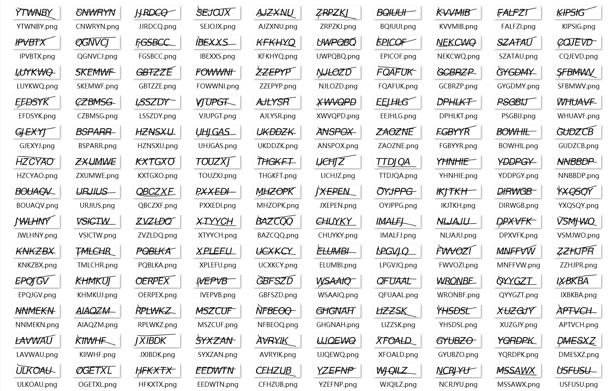
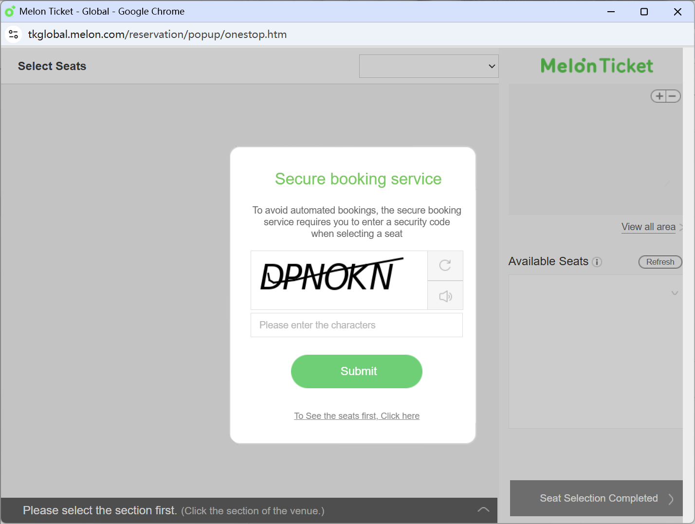

# 验证码采集与简易识别工具

这是一个针对 Melon Ticket - Global 网站的验证码自动采集和简易识别工具集。本工具包含验证码采集和识别两个主要功能模块。



## 目录结构
```
├── collect_captcha.py  # 验证码采集脚本
├── quick_ocr.py        # 验证码识别脚本
├── requirements.txt    # 项目依赖文件
├── saved_captcha/      # 验证码图片保存目录
└── processed_captcha/  # 识别后的验证码保存目录
```

## 安装步骤

### 1. 安装 Python 依赖
```bash
pip install -r requirements.txt
```

### 2. 安装 Tesseract-OCR
1. 访问 [Tesseract-OCR 下载页面](https://github.com/UB-Mannheim/tesseract/wiki)
2. 下载并安装 Tesseract-OCR（Windows 用户选择 Windows 版本）
3. 默认安装路径为：`C:\Program Files\Tesseract-OCR\`
4. 安装时请记住安装路径，后续需要使用

## 使用说明

### 1. 启动 Chrome 浏览器
在终端中运行以下命令：
```bash
"C:\Program Files\Google\Chrome\Application\chrome.exe" --remote-debugging-port=9222 --user-data-dir="C:/Users/你的用户名/AppData/Local/Google/Chrome/User Data"
```
注意：
- 请将路径中的 "你的用户名" 替换为实际的 Windows 用户名
- 如果 Chrome 安装在其他位置，请相应修改路径

进入Chrome浏览器，打开Melon Ticket - Global 网站，登陆并进入到购票弹窗页面，确保验证码图片可以正常显示。



### 2. 采集验证码（collect_captcha.py）
1. 运行采集脚本：
```bash
python collect_captcha.py
```
2. 脚本会自动：
   - 连接到已打开的 Chrome 浏览器
   - 创建 saved_captcha 文件夹（如果不存在）
   - 等待用户按回车键开始采集
   - 自动采集 200 张验证码图片
   - 图片将保存在 saved_captcha 文件夹中

### 3. 识别验证码（quick_ocr.py）
1. 运行识别脚本：
```bash
python quick_ocr.py
```
2. 脚本会自动：
   - 检查必要的目录和 Tesseract 安装
   - 读取 saved_captcha 中的图片
   - 对每张图片进行预处理和 OCR 识别
   - 将识别结果作为文件名，保存原图到 processed_captcha 文件夹

## 文件说明

### collect_captcha.py
- 功能：自动采集验证码图片
- 工作流程：
  1. 连接到已打开的 Chrome 浏览器
  2. 等待用户确认开始采集
  3. 循环采集验证码图片
  4. 自动点击刷新按钮获取新的验证码
  5. 将图片保存到 saved_captcha 文件夹

### quick_ocr.py
- 功能：识别验证码图片内容
- 工作流程：
  1. 读取 saved_captcha 中的图片
  2. 对图片进行预处理（添加白色背景、反色等）
  3. 使用 Tesseract-OCR 识别文字
  4. 将原图以识别结果命名保存到 processed_captcha 文件夹

## 注意事项

1. 运行环境要求：
   - Python 3.6 或更高版本
   - Chrome 浏览器
   - Windows 操作系统（其他系统需要修改相应路径）

2. 常见问题：
   - 如果提示 "未找到 Tesseract-OCR"，请检查安装路径
   - 如果无法连接 Chrome，请确认浏览器已正确启动
   - 如果识别率不理想，可能需要调整图片预处理参数

3. 文件夹说明：
   - saved_captcha：存放原始验证码图片
   - processed_captcha：存放识别后的图片（使用识别文本命名）
   - temp：临时文件夹（程序运行时自动创建和删除）


## 免责声明
本工具仅供教育和研究目的使用。用户应遵守网站的服务条款以及相关法律法规。作者不对工具的滥用或使用后可能产生的任何后果负责。

如有问题或建议，请提交 Issue。
